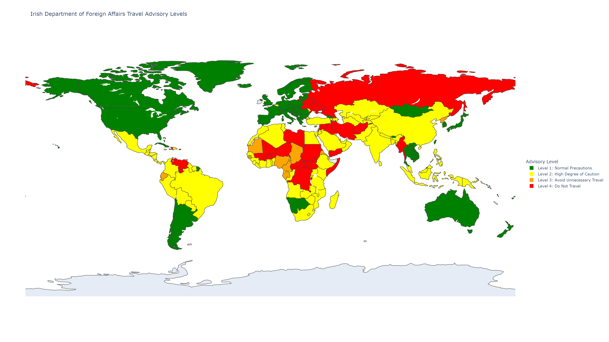

# Irish Travel Advisory Map

A Python tool that scrapes the Irish Department of Foreign Affairs travel advisories and generates a color-coded world map showing safety levels for every country.



## Advisory Levels

- Green (Level 1): Normal Precautions - Exercise normal security precautions
- Yellow (Level 2): High Degree of Caution - Exercise a high degree of caution
- Orange (Level 3): Avoid Unnecessary Travel - Avoid non-essential travel
- Red (Level 4): Do Not Travel - Do not travel to this country

## Features

- Automatically scrapes all country advisories from dfa.ie
- Generates high-resolution world map with color-coded countries
- Exports data to CSV for analysis
- Creates interactive HTML map
- Saves PNG image suitable for sharing

## Requirements

- Python 3.7 or higher
- See requirements.txt for package dependencies

## Installation

Clone this repository and install dependencies:

```bash
git clone https://github.com/yourusername/irish-travel-advisory-map.git
cd irish-travel-advisory-map
pip install -r requirements.txt
```

## Usage

Run the scraper to collect current data:

```bash
python scrape_advisories.py
```

Generate the map from the collected data:

```bash
python create_map.py
```

Note: If the website blocks automated requests (403 error), the script will provide instructions for manual data collection via your browser console.

## Output Files

- `irish_travel_advisories.csv` - Raw data with all countries and advisory levels
- `irish_travel_advisory_map.png` - High-resolution static map (1920x1080)
- `irish_travel_advisory_map.html` - Interactive map (open in browser)

## How It Works

1. The scraper visits each country's advisory page on dfa.ie
2. BeautifulSoup extracts the advisory level from page content
3. Country names are standardized to match mapping library conventions
4. Plotly creates a choropleth map with discrete color categories
5. Data and visualizations are exported in multiple formats

## Ethical Considerations

- Script includes 1-second delays between requests to avoid overwhelming the server
- Should not be run more than once per day
- All data is sourced from public government information
- For educational and informational use only

## Data Source

All travel advisory data is sourced from the [Irish Department of Foreign Affairs](https://www.ireland.ie/en/dfa/overseas-travel/advice/).

**Disclaimer**: This tool is for informational purposes only. Always check the official DFA website for the most current travel advice before making travel decisions. This project is not affiliated with or endorsed by the Irish Department of Foreign Affairs.

## Contributing

Contributions welcome. Please open an issue to discuss proposed changes before submitting a pull request.

## License

MIT License - see LICENSE file for details.

## Last Updated

Data last scraped: 15 Dec 2025
